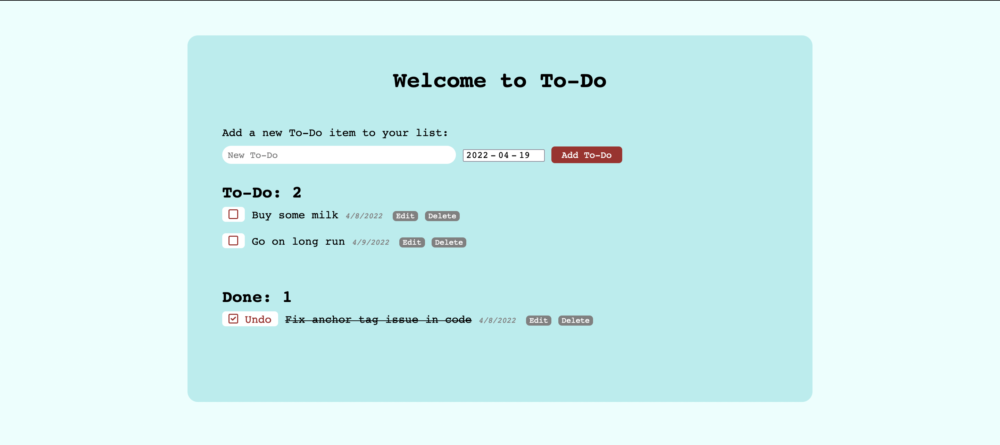

# Simple To-Do list app 🎨

This app is deployed [here](https://colour-palette-generator-pg.herokuapp.com/).

This is a simple Flask App that lets users create to-do lists and mark their items as done as they go. For the sake of simplicity here, I removed the login part for now. It will be added at a later time so actual users can use this app.

`main.py` is the python file to run.

## 👨🏼‍🎓 Learnings:
1. This project was a great opportunity to use HTML forms and GET/POST requests
2. This app was a good way to get more comfortable manipulating databases: creating new elements, editing or deleting them, and ordering elements so they would appear chronologically 
3. It was also a good design exercise to find a way to keep the app very minimalist while having all the functionalities I find mandatory (seeing completed items, easily checking tasks dynamically, editing/deleting tasks)

## 🚀 Tech and tools:

This app was built using 3 technologies:
- **Flask**: microframework for web development
- **SQLAlchemy**: store to-do items (will also be used to store user database when this part is implemented)
- **PostgreSQL**: depending on when you are seeing this, I will have switched the SQLAlchemy DB to PostgreSQL.

Deployment:
- **Gunicorn**
- **GitHub**
- **Heroku**

## 🔜 Things I would improve:
- Add user log-in: adding a form for users to log in or register. This way I will modify the database to include an owner (via its user ID) to each to-do item
- Add a priority variable to each to-do item: in addition to ordering items chronologically, I think it is beneficial to have a priority set for each item to know which ones should be done first
- Rework design: the design is a little too minimalist and not really mobile friendly at this time

## ⚙️ How does it work:
Nothing simpler than a to-do app but here it is:
1. Login to your account (for the sake of presentation, the login part has been removed for quicker access)
2. Add new to-do items to your list and set their due date
3. Click "Add To-Do"
4. Your To-Dos are now displayed chronologically
5. Click the edit button if you need to edit the name or the due date
6. Check your to-dos as you go and get your day going

